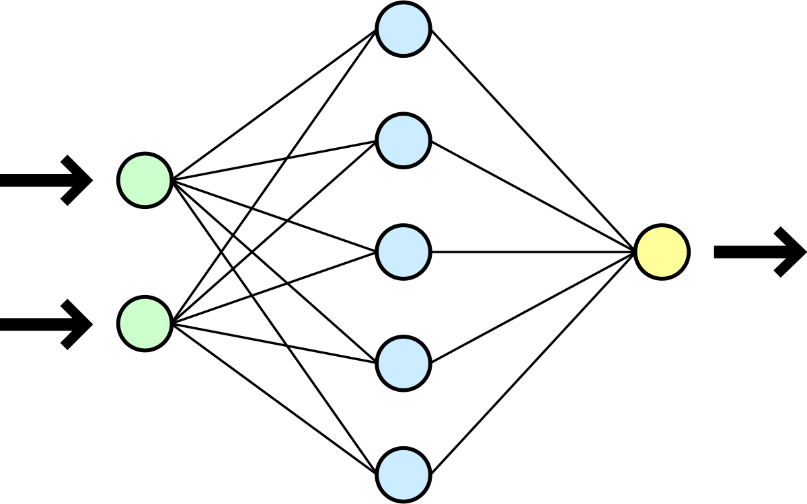

  

  

# Cyber

Cyber is an implementation of Optical Flow variants with Neural Networks.
The goal of Cyber is to accurately estimate car speed in real-time.
More details will be given as the project develops.

## License

&copy; [Luis Maya Aranda](https://github.com/0x000E). All rights reserved.

Licensed under the MIT License.