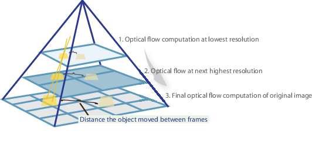

# What is Optical Flow?

Optical flow is the motion of objects between consecutive
frames of sequence, caused by relative movement between the
object and camera. It allows for processing real-time video
to find the relationship between consecutive frames. For example,
we want to track the motion of vehicles across frames to estimate
its current velocity and predict its position in the next frame.

## Sparse vs Dense Optical Flow

There are two main variants of optical flow, sparse and dense.
__*Sparse optical flow*__ gives the flow vectors of key features
(i.e. few pixels depicting the edges or corners of an object)
within the frame. On the other hand, __*dense optical flow*__  gives 
the flow vectors of the entire frame (all pixels) - up to one 
flow vector per pixel. With this in mind, *dense optical flow* 
has a higher accuracy at the cost of being more computationally expensive. 

  

## Implementing Sparse Optical Flow

*Sparse optical flow* selects a sparse feature set of pixels
(i.e. features such as edges and corners) to track its velocity
vectors (motion). The extracted features are passed in the optical
flow function from frame to frame to ensure that the same points are
being tracked. There are various implementations of
*sparse optical flow*, including the [Lucas-Kanade](https://en.wikipedia.org/wiki/Lucas%E2%80%93Kanade_method) method, [Horn-Schunck](https://en.wikipedia.org/wiki/Horn%E2%80%93Schunck_method) method, and more. We will be using the
__*Lucas-Kanade*__ method with `OpenCV`.

#### Shi-Tomasi Corner Detector - selecting the pixels to track

For the implementation of sparse optical flow, we only track the motion
of a feature set of pixels. Features in images are points of interest which
present rich content information. For example, such features may be points
in the image that are invariant to translation, scale, rotation, and intensity
such as corners.

The [Shi-Tomasi Corner Detector](https://en.wikipedia.org/wiki/Corner_detection#The_Harris_&_Stephens_/_Shi%E2%80%93Tomasi_corner_detection_algorithms) is very similar to the Harris Corner Detector.

  

The documentation of OpenCV’s implementation of Shi-Tomasi via
`goodFeaturesToTrack()` may be found [here](https://docs.opencv.org/3.0-beta/modules/imgproc/doc/feature_detection.html#goodfeaturestotrack).

#### Lucas-Kanade: Sparse Optical Flow

Lucas and Kanade proposed an effective technique to estimate the motion of interesting 
features by comparing two consecutive frames in their [paper](https://ri.cmu.edu/pub_files/pub3/lucas_bruce_d_1981_2/lucas_bruce_d_1981_2.pdf). The Lucas-Kanade method works under the following assumptions:

  1. Two consecutive frames are separated by a small time increment (dt) such that objects are not displaced significantly (in other words, the method work best with slow-moving objects).

  2. A frame portrays a “natural” scene with textured objects exhibiting shades of gray that change smoothly.

In a nutshell, we identify some interesting features to track and iteratively compute the optical flow vectors of these points. However, adopting the Lucas-Kanade method only works for small movements (from our initial assumption) and fails when there is large motion. Therefore, the OpenCV implementation of the Lucas-Kanade method adopts pyramids.

  

In a high-level view, small motions are neglected as we go up the pyramid and large motions are reduced to small motions - we compute optical flow along with scale. The documentation of OpenCV’s implementation of the Lucas-Kanade method via `calcOpticalFlowPyrLK()` may be found [here](https://docs.opencv.org/3.0-beta/modules/video/doc/motion_analysis_and_object_tracking.html#calcopticalflowpyrlk)

## Implementing Dense Optical Flow

Dense optical flow attempts to compute the optical flow vector for every pixel of each frame. While such computation may be slower, it gives a more accurate result and a denser result suitable for applications such as [Learning of Structure and Motion from Video](https://arxiv.org/abs/1704.07804) and 
[video segmentation](http://files.is.tue.mpg.de/black/papers/TsaiCVPR2016.pdf). There are various implementations of dense optical flow, we will be using the __*Farneback method*__.

#### Farneback Optical Flow

Gunnar Farneback proposed an effective technique to estimate the motion of interesting features by comparing two consecutive frames in his paper [Two-Frame Motion Estimation Based on Polynomial Expansion](http://www.diva-portal.org/smash/get/diva2:273847/FULLTEXT01.pdf).

First, the method approximates the windows of image frames by quadratic polynomials through polynomial expansion transform. Second, by observing how the polynomial transforms under translation (motion), a method to estimate displacement fields from polynomial expansion coefficients is defined. After a series of refinements, dense optical flow is computed.

For OpenCV’s implementation, it computes the magnitude and direction of optical flow from a 2-channel array of flow vectors (__*dx/dt,dy/dt*__), the optical flow problem. It then visualizes the angle (direction) of flow by hue and the distance (magnitude) of flow by value of HSV color representation. The strength of HSV is always set to a maximum of 255 for optimal visibility. The documentation of OpenCV’s implementation of the Farneback method via `calcOpticalFlowFarneback()` may be found [here](https://docs.opencv.org/3.0-beta/modules/video/doc/motion_analysis_and_object_tracking.html#calcopticalflowfarneback).