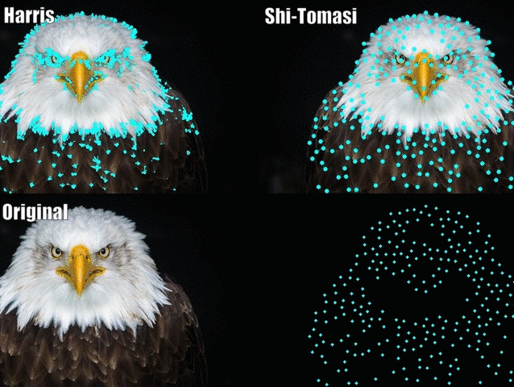

# What is Optical Flow?

Optical flow is the motion of objects between consecutive
frames of sequence, caused by relative movement between the
object and camera. It allows for processing real-time video
to find the relationship between consecutive frames. For example,
we want to track the motion of vehicles across frames to estimate
its current velocity and predict its position in the next frame.

## Sparse vs Dense Optical Flow

There are two main variants of optical flow, sparse and dense.
__*Sparse optical flow*__ gives the flow vectors of key features
(i.e. few pixels depicting the edges or corners of an object)
within the frame. On the other hand, __*dense optical flow*__  gives 
the flow vectors of the entire frame (all pixels) - up to one 
flow vector per pixel. With this in mind, *dense optical flow* 
has a higher accuracy at the cost of being more computationally expensive. 

  

## Implementing Sparse Optical Flow

*Sparse optical flow* selects a sparse feature set of pixels
(i.e. features such as edges and corners) to track its velocity
vectors (motion). The extracted features are passed in the optical
flow function from frame to frame to ensure that the same points are
being tracked. There are various implementations of
*sparse optical flow*, including the [Lucas-Kanade](https://en.wikipedia.org/wiki/Lucas%E2%80%93Kanade_method) method, [Horn-Schunck](https://en.wikipedia.org/wiki/Horn%E2%80%93Schunck_method) method, and more. We will be using the
__*Lucas-Kanade*__ method with `OpenCV`.

#### Shi-Tomasi Corner Detector - selecting the pixels to track

For the implementation of sparse optical flow, we only track the motion
of a feature set of pixels. Features in images are points of interest which
present rich content information. For example, such features may be points
in the image that are invariant to translation, scale, rotation, and intensity
such as corners.

The [Shi-Tomasi Corner Detector](https://en.wikipedia.org/wiki/Corner_detection#The_Harris_&_Stephens_/_Shi%E2%80%93Tomasi_corner_detection_algorithms) is very similar to the Harris Corner Detector.

  

The documentation of OpenCV’s implementation of Shi-Tomasi via
`goodFeaturesToTrack()` may be found [here](https://docs.opencv.org/3.0-beta/modules/imgproc/doc/feature_detection.html#goodfeaturestotrack).

